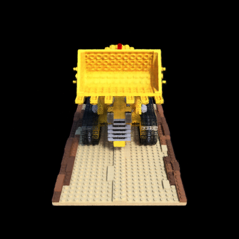
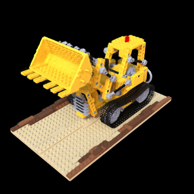
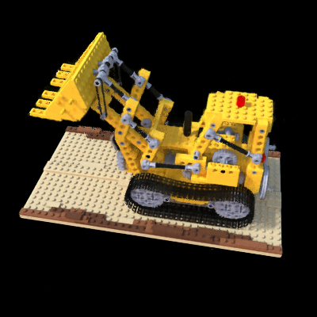
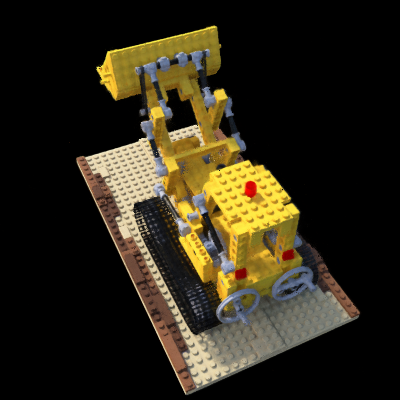
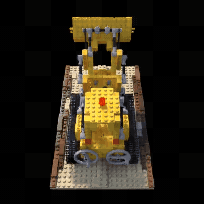

# NeRF: Representing Scenes as Neural Radiance Fields for View Synthesis

Implementation of the paper [NeRF: Representing Scenes as Neural Radiance Fields for View Synthesis
](https://arxiv.org/abs/2003.08934).

## Requirements

- Python 3.8+  
- CUDA-enabled GPU with PyTorch support  

Install dependencies:

```
pip install -r requirements.txt
```

## Usage
1. Training:
   
   Run the end-to-end training and rendering pipeline:
   ```
   chmod +x run_lego.sh
   ./run_lego.sh
   ```
   This will:
   
    - Train the NeRF model (resume from last checkpoint if present)
    - Render novel views for the test split
    - Encode the rendered frames into `outputs/lego_test/video.mp4`

2. Manual Usage:

   Train only
   ```
   python3 -m scripts.train
   --config configs/synthetic_lego.yaml
   --expname lego_full
   [--resume]
   ```

   Render only
   ```
   LATEST=$(ls logs/lego_full/checkpoint_*.pth | sort -V | tail -n1)
   python3 -m scripts.render \
     --config configs/synthetic_lego.yaml \
     --expname lego_full \
     --ckpt "$LATEST" \
     --split test \
     --outdir outputs/lego_test
   ```

   Encode video
   ```
   cd outputs/lego_test
   ffmpeg -y -framerate 30 -i %03d.png \
     -c:v libx264 -pix_fmt yuv420p video.mp4
   ```

## Results
#### Sample Renders
| Frame 150 | Frame 162 | Frame 178 | Frame 193
|-----------|-----------|-----------|-----------|
|  |  |  | 

#### NeRF Fly-Around

