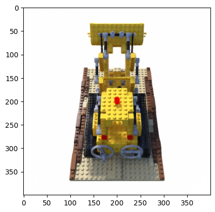

# NeRF: Representing Scenes as Neural Radiance Fields for View Synthesis

Implementation of the paper [NeRF: Representing Scenes as Neural Radiance Fields for View Synthesis
](https://arxiv.org/abs/2003.08934).

## Results

#### Novel views rendered from the optimized NeRF representation

               |   
:-------------------------:|:-------------------------:
  |  

